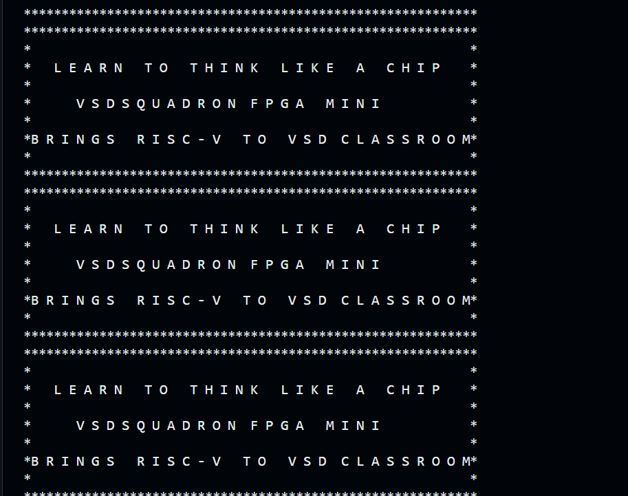

# 🚀 RISC-V FPGA IP Design – VSD Internship

# Task 3: Environment Setup & RISC-V Reference Bring-Up

## Objective

The objective of this task was to set up the development environment, verify the RISC-V software toolchain, execute a reference RISC-V program using the Spike ISA simulator, and validate the VSDFPGA lab environment.

This task focuses on:

* Environment setup and verification
* Understanding the RISC-V software execution flow
* Familiarization with the development workflow
* Preparation for future FPGA and IP integration tasks


**Codespace Setup → RISC-V Verification → VSDFPGA Lab → Local VM Setup → FPGA Build → Understanding Questions → Conclusion.**


# Step 1: GitHub Codespace Setup

## Repository Fork

The official repository was forked to my GitHub account:

```text
https://github.com/vsdip/vsd-riscv2
```

## Codespace Creation

A GitHub Codespace was launched from the forked repository.

The environment was successfully created and all required tools were available inside the Codespace.
---

# Step 2: Verification of RISC-V Reference Flow

## Toolchain Verification

The following tools were verified successfully:

```bash
riscv64-unknown-elf-gcc --version
spike --version
iverilog -V
```

### Verified Components

* RISC-V GCC Toolchain
* Spike ISA Simulator
* Icarus Verilog (iverilog)

## Running the Reference Program

The sample program available in the `samples` directory was compiled and executed.

### Compilation

```bash
cd samples
riscv64-unknown-elf-gcc -o sum1ton.o sum1ton.c
```

### Execution

```bash
spike pk sum1ton.o
```

### Observed Output

```text
bbl loader

Sum from 1 to 8 is 36
```

### Observation

The successful execution confirms that:

* The RISC-V GCC compiler is functioning correctly.
* The generated binary is compatible with the Spike ISA simulator.
* The complete software execution flow is operational.


---

# Step 3: VSDFPGA Lab Verification

## Repository Clone

```bash
git clone https://github.com/vsdip/vsdfpga_labs.git
```

## Navigating to the Lab

```bash
cd vsdfpga_labs/basicRISCV/Firmware
```

## Reviewing the Firmware

The source file:

```text
riscv_logo.c
```

was reviewed successfully.

The program continuously prints the VSD Squadron FPGA Mini banner using UART output routines.


## Generating BRAM Firmware Image

```bash
make riscv_logo.bram.hex
```

Generated:

```text
riscv_logo.bram.hex
```


## Generating Executable ELF

```bash
make riscv_logo.bram.elf
```

Generated:

```text
riscv_logo.bram.elf
```


## Spike Simulation Attempt

```bash
spike pk riscv_logo.bram.elf
```

### Observed Result

```text
Kernel load segfault
```

### Observation

The firmware is designed for execution from FPGA BRAM using a custom linker script and hardware-specific memory map. Therefore, it cannot be executed directly as a standard user-space application under Spike Proxy Kernel.


---

---
**## Now We Do Cross compiling of this code in RISCV and Simulate with SPIKE**
```bash
riscv64-unknown-elf-gcc -O1 -mabi=lp64 -march=rv64i -o riscv_logo.o riscv_logo.c
spike pk riscv_logo.o
```




---
# Step 4: Local Development Environment (VM Setup)

## Repository Setup

The VSDFPGA laboratory repository was cloned successfully in the local environment:

```bash
git clone https://github.com/vsdip/vsdfpga_labs.git
cd vsdfpga_labs/basicRISCV
```


To prepare for FPGA hardware development and testing, a dedicated Linux Virtual Machine (VM) was set up. While GitHub Codespaces is suitable for software development and simulation, it cannot provide direct access to FPGA hardware connected through USB.

## Why a Virtual Machine is Required

### Limitations of GitHub Codespaces

* Limited availability of FPGA-specific tools and package versions.
* Some FPGA development packages may be missing or outdated.
* No USB Passthrough support for physical FPGA boards.
* Potential version mismatches between synthesis, place-and-route, and device support tools.

### Benefits of a Dedicated Virtual Machine

* Complete control over tool versions and dependencies.
* Direct USB access to FPGA hardware.
* Proper compatibility between Yosys, ABC, NextPNR, and IceStorm toolchains.
* A stable environment for FPGA implementation and board-level testing.

---

## 4.1 Virtual Machine Setup(for Linux )

A Linux Virtual Machine (Ubuntu 20.04 LTS or later) was configured for FPGA development.

The required packages were installed using:

```bash
sudo apt-get update

sudo apt-get install -y git vim autoconf automake autotools-dev curl \
libmpc-dev libmpfr-dev libgmp-dev gawk build-essential bison flex \
texinfo gperf libtool patchutils bc zlib1g-dev libexpat1-dev

sudo apt-get install -y yosys nextpnr-ice40 fpga-icestorm iverilog

sudo apt-get install -y gtkwave picocom
```

These packages provide the FPGA synthesis, place-and-route, simulation, and debugging environment required for future hardware tasks.

---

## 4.2 Repository Setup

Both internship repositories were cloned inside the virtual machine:

```bash
cd ~

git clone https://github.com/vsdip/vsd-riscv2.git
git clone https://github.com/vsdip/vsdfpga_labs.git
```

This ensured that the same development workflow used in GitHub Codespaces was available locally.

---

## 4.3 RISC-V Toolchain Installation

The SiFive RISC-V GCC toolchain was installed inside the virtual machine:

```bash
cd ~

mkdir -p riscv_toolchain
cd riscv_toolchain

wget "https://static.dev.sifive.com/dev-tools/riscv64-unknown-elf-gcc-8.3.0-2019.08.0-x86_64-linux-ubuntu14.tar.gz"

tar -xvzf riscv64-unknown-elf-gcc-*.tar.gz

echo 'export PATH=$HOME/riscv_toolchain/riscv64-unknown-elf-gcc-8.3.0-2019.08.0-x86_64-linux-ubuntu14/bin:$PATH' >> ~/.bashrc

source ~/.bashrc
```

Installation was verified using:

```bash
riscv64-unknown-elf-gcc --version
```

---

## 4.4 Dockerfile Review

The Dockerfile provided in the repository was reviewed as a reference document for environment setup and dependency management.

Reference:

```text
https://raw.githubusercontent.com/vsdip/vsd-riscv2/refs/heads/main/.devcontainer/Dockerfile
```

### Important Note

The Dockerfile was **not executed directly** using Docker. Instead, it was used to understand:

* Required software packages
* Development tool dependencies
* Installation sequence
* Environment configuration requirements

All tools were installed natively inside the virtual machine using the commands provided above.

---

## Outcome

A complete local FPGA development environment was successfully prepared. The virtual machine now contains the required RISC-V toolchain, FPGA development tools, simulation utilities, and laboratory repositories needed for upcoming FPGA implementation, IP integration, and hardware testing tasks.


In addition to GitHub Codespaces, a local VSDSquadron Linux virtual machine environment was configured to prepare for future FPGA development tasks.

The local environment provides direct access to FPGA development tools and hardware interfaces required for board-level implementation and testing.

---
## FPGA Build Flow

The RTL design was built locally using the provided RTL flow.

The following stages completed successfully:

* RTL Synthesis
* Placement
* Routing
* Bitstream Generation

Generated files:

```text
SOC.json
SOC.asc
SOC.bin
```

The successful generation of `SOC.bin` confirms that the FPGA implementation flow executed correctly on the local machine.

## FPGA Programming Attempt

The generated FPGA bitstream was programmed using:

```bash
sudo make flash
```

### Flashing Result

```text
init..
Can't find iCE FTDI USB device (vendor_id 0x0403, device_id 0x6010 or 0x6014).
ABORT.
```

### Observation

The FPGA build process completed successfully and produced the final bitstream file (`SOC.bin`). However, the FPGA board could not be detected by the host system during the flashing stage.

This indicates a USB detection, driver, or hardware connection issue rather than a problem with the RTL design or FPGA build process.


---

# Understanding Questions

## 1. Where is the RISC-V program located in the vsd-riscv2 repository?

The reference RISC-V program is located inside the `samples` directory.

Example:

```text
samples/sum1ton.c
```

## 2. How is the program compiled and loaded into memory?

The source code is compiled using the RISC-V GCC cross-compiler.

```bash
riscv64-unknown-elf-gcc -o sum1ton.o sum1ton.c
```

The executable is then loaded and executed by Spike using the Proxy Kernel.

```bash
spike pk sum1ton.o
```

## 3. How does the RISC-V core access memory and memory-mapped I/O?

The RISC-V processor accesses memory and peripherals through load and store instructions. Peripherals are mapped into specific memory address ranges, allowing the processor to communicate with hardware through memory transactions.

## 4. Where would a new FPGA IP block logically integrate in this system?

A new FPGA IP block would be integrated as a memory-mapped peripheral connected to the SoC interconnect. The processor would access the IP using dedicated address ranges.


---

# Results Summary

| Item                             | Status |
| -------------------------------- | ------ |
| GitHub Fork Created              | ✅      |
| Codespace Created                | ✅      |
| Toolchain Verified               | ✅      |
| Spike Verified                   | ✅      |
| RISC-V Program Compiled          | ✅      |
| RISC-V Program Executed          | ✅      |
| VSDFPGA Repository Cloned        | ✅      |
| Firmware Reviewed                | ✅      |
| BRAM HEX Generated               | ✅      |
| BRAM ELF Generated               | ✅      |
| Local VM Setup Completed         | ✅      |
| FPGA Bitstream Generated         | ✅      |
| Understanding Questions Answered | ✅      |


---
# Key Learnings and Outcomes

Through this task, a complete RISC-V and FPGA development workflow was successfully explored and validated.

### Environment Verification

* Successfully configured and used GitHub Codespaces.
* Verified the RISC-V GCC Toolchain, Spike ISA Simulator, and Icarus Verilog environment.
* Confirmed that the software development flow was functioning correctly.

### RISC-V Software Execution

* Compiled a RISC-V C program using the RISC-V cross-compiler.
* Executed the generated binary using the Spike ISA Simulator.
* Observed correct program execution and output generation.

### VSDFPGA Lab Exploration

* Cloned and explored the VSDFPGA laboratory repository.
* Reviewed the firmware source code (`riscv_logo.c`).
* Generated BRAM initialization files (`.hex`) and executable firmware (`.elf`).
* Understood the role of BRAM-based firmware execution in FPGA systems.

### Local Development Environment

* Configured a local VSDSquadron Linux development environment.
* Successfully cloned and built the FPGA RTL design locally.
* Executed synthesis, placement, routing, and bitstream generation flow.

### FPGA Design Flow Understanding

The complete FPGA implementation flow was studied and executed:

```text
RTL Design
    ↓
Synthesis
    ↓
Place & Route
    ↓
Bitstream Generation
    ↓
FPGA Programming
```

The final FPGA bitstream (`SOC.bin`) was generated successfully, confirming that the FPGA build flow executed correctly.

### System Architecture Understanding

Through this task, the following concepts were understood:

* RISC-V software compilation flow
* Program loading and execution using Spike
* Memory-mapped I/O architecture
* FPGA BRAM-based firmware execution
* FPGA implementation flow (Synthesis → Place & Route → Bitstream)
* Integration of future custom FPGA IP blocks into a RISC-V SoC

### Overall Outcome

Task-1 successfully established a complete development environment and workflow for future FPGA, RTL, IP Design, and SoC integration activities during the VSD FPGA Internship.

# Conclusion

Task 1 was completed successfully.

The development environment was configured using GitHub Codespaces and a local VSDSquadron Linux environment. The RISC-V toolchain was verified, reference applications were executed successfully, VSDFPGA lab firmware was generated successfully, and the FPGA RTL flow completed successfully with generation of the final bitstream (`SOC.bin`).

This establishes a working baseline environment for future FPGA integration, RTL development, IP design, and SoC-level development tasks throughout the internship.


